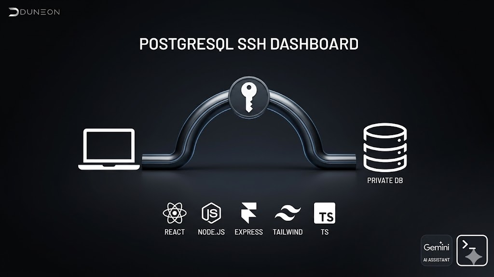
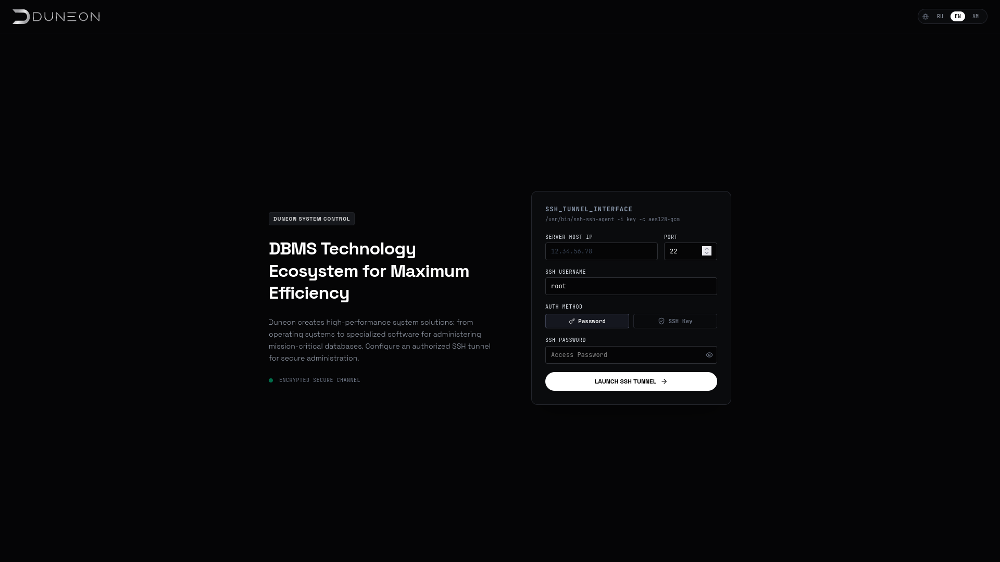
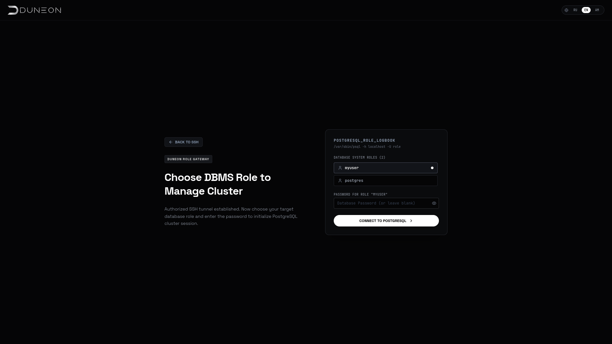
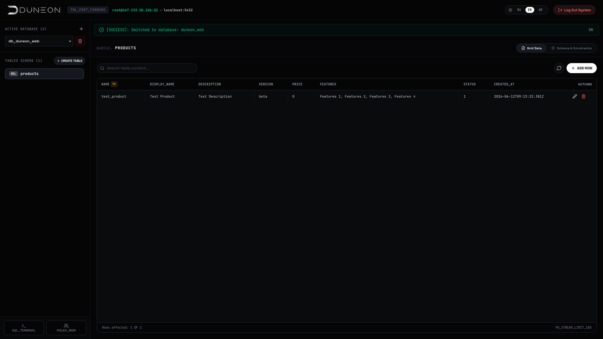
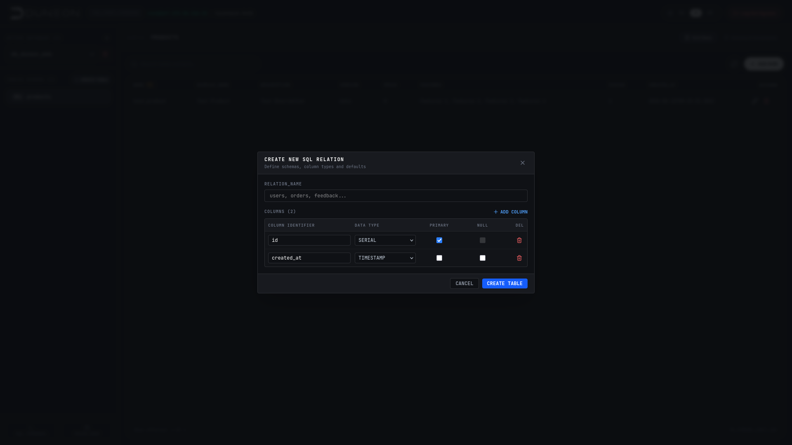
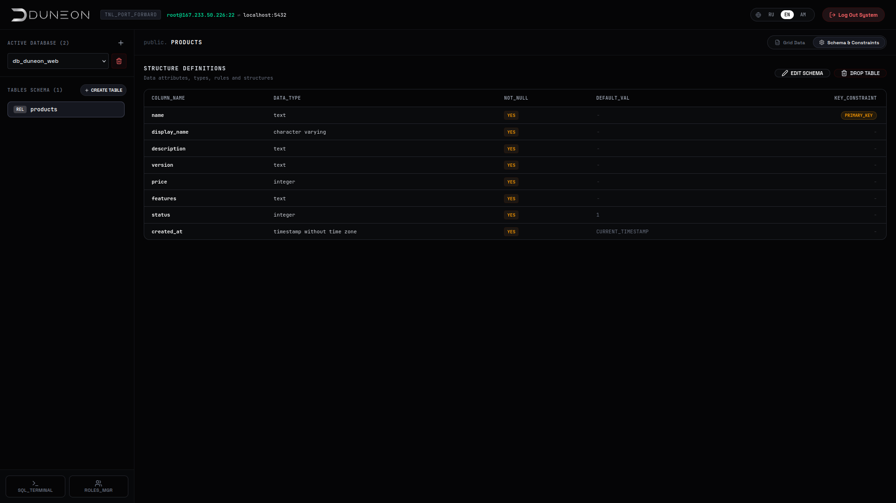
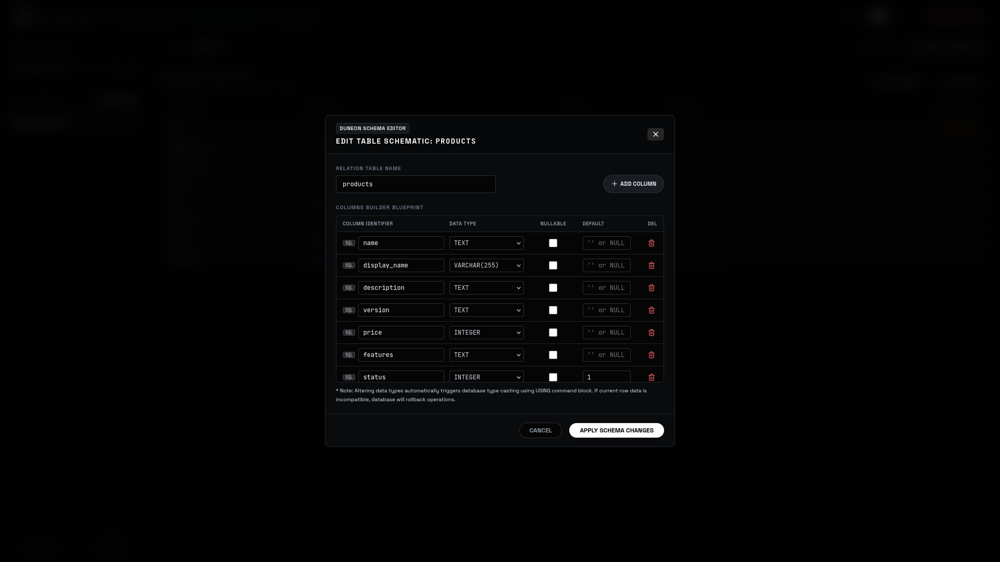
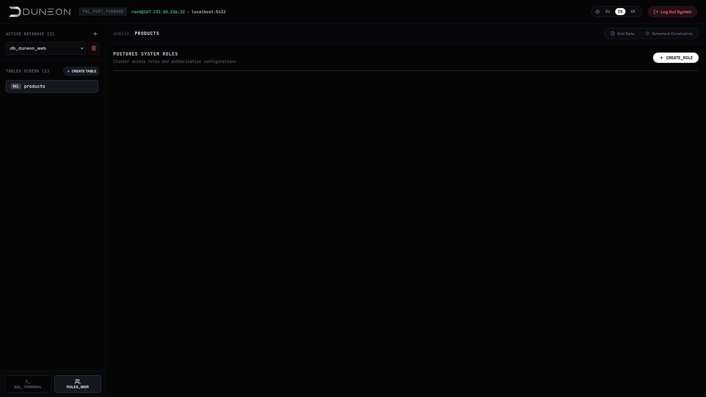
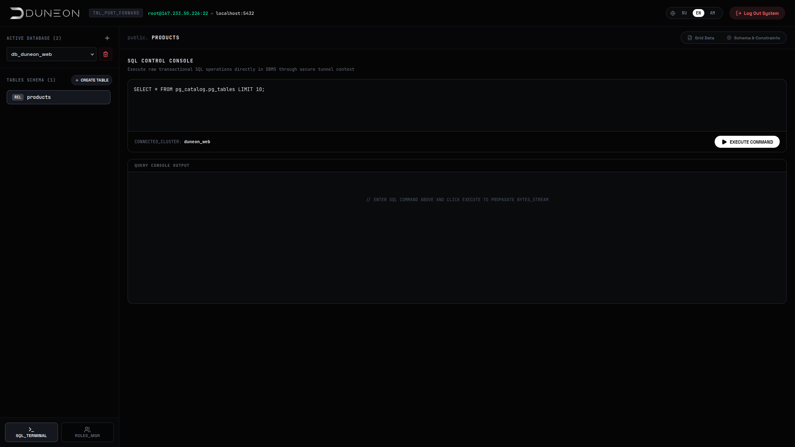

# PostgreSQL SSH Dashboard

A modern, secure web-based dashboard for managing **PostgreSQL** databases on remote servers through an **SSH tunnel**.



## ✨ Features

- **Secure SSH Tunneling** — Connect to PostgreSQL servers that are not directly accessible (behind firewalls, private networks, VPS, etc.)
- **SSH Authentication** — Support for password and private key authentication
- **PostgreSQL Administration**:
  - Browse databases
  - View tables and their structure
  - Preview table content (up to 150 rows)
  - Create and delete databases
  - Create, modify, and delete tables and columns
  - Manage PostgreSQL users (including Superuser role)
- **Modern UI** — Built with React 19, Tailwind CSS, and smooth animations
- **AI Assistant** — Integrated with Google Gemini (optional)
- **Multi-language support** — English, Russian, and more

## 🛠  Tech Stack

**Frontend:**
- React 19 + TypeScript
- Vite
- Tailwind CSS
- Lucide Icons
- Framer Motion

**Backend:**
- Node.js + Express
- `ssh2` — SSH tunneling
- `pg` — PostgreSQL client
- TypeScript

## 🚀 Quick Start

### 1. Clone the repository
```bash
git clone https://github.com/DuneonDev/PostgreSQL-SSH-Dashboard.git
cd PostgreSQL-SSH-Dashboard
```

### 2. Install dependencies
```bash
npm install
```

### 3. Configure environment
```bash
cp .env.example .env
```
Edit `.env` and add your **Gemini API key** (optional):
```env
GEMINI_API_KEY=your_gemini_api_key_here
```

### 4. Run the application
**Development mode:**
```bash
npm run dev
```
**Production build:**
```bash
npm run build
npm start
```
The application will be available at `http://localhost:3000`

## 📸 Screenshots









## 🔒 Security Notes
- All PostgreSQL connections are established through SSH tunnels
- No direct exposure of PostgreSQL port (5432) to the internet
- Credentials are not stored — entered per session
- Use strong SSH keys in production

## 🧩 Project Structure
```text
├── src/                 # React frontend
├── server/              # Backend logic
├── server.ts            # Main server entry point
├── public/              # Static assets
├── .env.example         # Environment variables template
└── package.json
```

## 🤝 Contributing
Contributions are welcome! Feel free to open issues or submit pull requests.

📄 License
This project is licensed under the MIT License.

---
Made with ❤️ by DuneonDev — High-performance system solutions.
<br>
website: [duneon.dev](https://duneon.dev)
<br>
support: [support@duneon.dev](mailto:support+postgresqlsshdashboard@duneon.dev)

